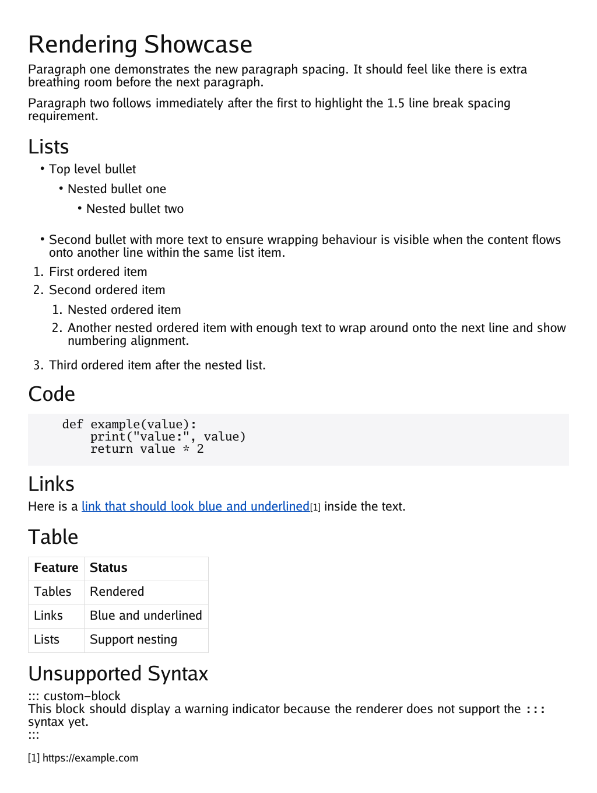
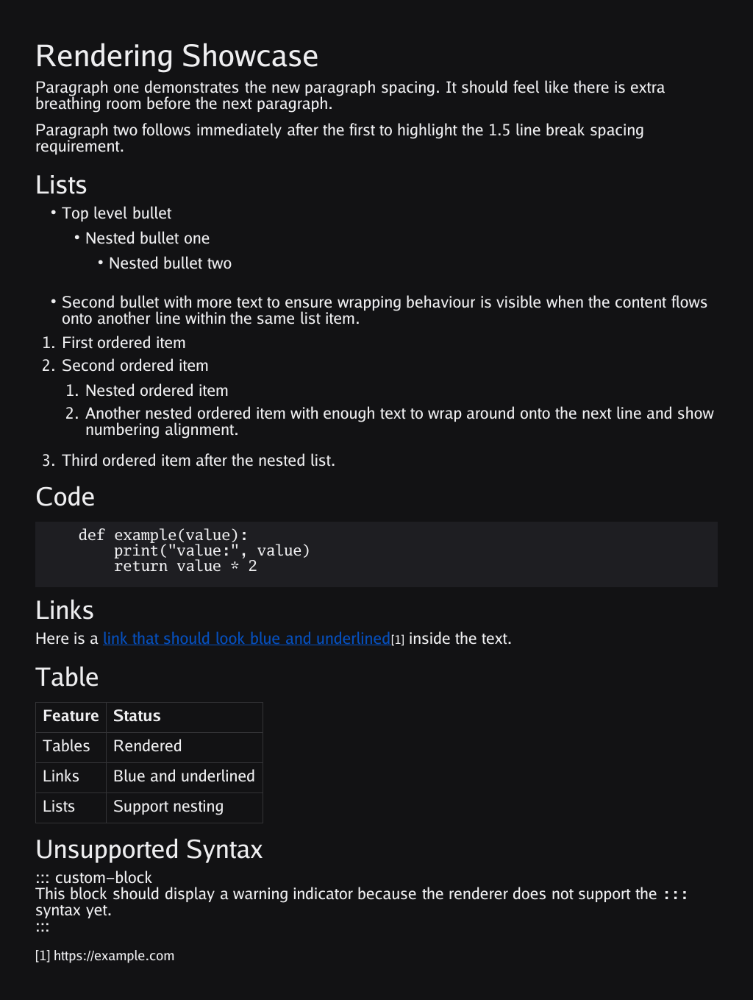

# md2png – Markdown to Image (Go CLI & Library)

`md2png` renders Markdown into PNG, JPG, or GIF files using only Go. It ships as a CLI and as a library so you can call it from your own code. No Node, headless browsers, or helper scripts.

---

## What it does

- Parses Markdown with `goldmark` and draws the result straight to an image buffer.
- Handles headings (H1–H5), paragraphs, ordered and unordered lists, bold text, code blocks, block quotes, tables, and horizontal rules.
- Dark and light themes, adjustable width, margin, and point size.
- Optional custom fonts: `--font`, `--fontbold`, `--fontmono`.
- Output format follows the `--out` extension.

---

## Install

Clone and build:

```bash
git clone https://github.com/arran4/md2png.git
cd md2png
go build ./cmd/md2png
go build ./cmd/md2view
```

Dependencies are pure Go packages:

```bash
go get github.com/yuin/goldmark@v1.7.4 \
       github.com/golang/freetype@v0.0.0-20170609003504-e2365dfdc4a0 \
       golang.org/x/image@latest
```

Requires Go 1.22 or newer.

---

## CLI usage

```bash
./md2png --in README.md --out out.png
```

### Flags

| Flag | Description | Default |
|------|-------------|---------|
| `--in` | Markdown input file, or stdin when empty | — |
| `--out` | Output image (`.png`, `.jpg`, `.gif`) | `out.png` |
| `--width` | Image width in pixels | 1024 |
| `--margin` | Margin in pixels | 48 |
| `--pt` | Base font size (points) | 16 |
| `--theme` | `light` or `dark` | `light` |
| `--font` | Regular font TTF path | built-in Go Regular |
| `--fontbold` | Bold font TTF path | built-in Go Bold |
| `--fontmono` | Monospace font TTF path | built-in Go Mono |
| `--footnote-links` | Emit link targets as numbered footnotes | `true` |
| `--footnote-images` | Emit image targets as numbered footnotes | `false` |
| `--max-height` | Maximum output height in pixels (0 for default) | 32768 |

### Examples

Render Markdown from disk:

```bash
./md2png --in example.md --out example.png
```

Dark theme, wider frame, larger type:

```bash
./md2png --in blogpost.md --out post.png --theme dark --width 1400 --pt 18
```

Produce an animated GIF (palette handled for you):

```bash
./md2png --in slides.md --out slides.gif
```

Use your own fonts:

```bash
./md2png --in notes.md --out notes.jpg \
  --font /usr/share/fonts/TTF/DejaVuSans.ttf \
  --fontmono /usr/share/fonts/TTF/DejaVuSansMono.ttf
```

From stdin:

```bash
echo "# Hello\nThis came from stdin!" | ./md2png --out hello.png
```

---

## md2view usage

`md2view` is a GUI viewer for Markdown. It supports the same flags as `md2png` for theming, fonts, width, and margins, but renders the Markdown in a zoomable, pannable desktop window instead of saving it to an image.

```bash
./md2view README.md
```

### Controls

- **Pan/Scroll:** Left Click and Drag, Arrow Keys, or PageUp/PageDown.
- **Zoom In/Out:** Mouse Wheel Up/Down, or `+` / `-` keys.
- **Quit:** `ESC` or `Q`.

---

## Library usage

```go
package main

import (
        "image/png"
        "os"

        "github.com/arran4/md2png"
)

func main() {
        img, err := md2png.Render([]byte("# Hello\nRendered inside Go!"), md2png.RenderOptions{})
        if err != nil {
                panic(err)
        }

        f, err := os.Create("hello.png")
        if err != nil {
                panic(err)
        }
        defer f.Close()

        if err := png.Encode(f, img); err != nil {
                panic(err)
        }
}
```

`RenderOptions` exposes the same knobs as the CLI. Set custom dimensions, limits (`MaxHeight`), swap themes, toggle link or image footnotes, or pass a font set created with `md2png.LoadFonts`.

### Security and Image Loading Policy

Rendering Markdown documents containing image tags (``) can initiate filesystem access (for local paths or `file://` URLs) and network requests (for `http://` or `https://` URLs).

#### Trusted CLI vs. Untrusted Input

- **Default / CLI behavior (`DefaultCLIImagePolicy()`)**:
  When using the CLI tools (`md2png`, `md2view`) or leaving `RenderOptions.ImagePolicy` as `nil`, `md2png` uses `DefaultCLIImagePolicy()`. This mode assumes trusted input and permits loading local images from the filesystem and remote images over HTTP/HTTPS, bounded by sensible safety limits (50 MB response limit, 8192×8192 px max dimensions, 1000 cache items). Missing images in trusted mode non-fatally fall back to alt text.

- **Untrusted Markdown (`StrictImagePolicy()`)**:
  When rendering Markdown from untrusted sources, configure a strict policy to prevent unauthorized filesystem disclosure and SSRF attacks:

  ```go
  policy := md2png.StrictImagePolicy()
  opts := md2png.RenderOptions{
      ImagePolicy: &policy,
  }
  img, err := md2png.Render(untrustedData, opts)
  ```

  `StrictImagePolicy()` disables local file access (`AllowLocal: false`), sandboxes local paths to `RenderOptions.BaseDir` (`SandboxLocal: true`), disables network requests (`AllowRemote: false`), limits images to 4096×4096 px and 5 MB, and bounds cache capacity to 100 items. Any policy denial, sandbox violation, or resource limit halts rendering immediately and returns typed sentinel errors (`ErrPolicyDenied`, `ErrSandboxViolation`, `ErrResourceLimit`).

#### Policy Controls

You can customize `md2png.ImagePolicy` with fine-grained controls:

| Control | Description |
|---|---|
| `AllowLocal` | Enables/disables reading local image files (`file://` or relative paths). |
| `SandboxLocal` | When `true`, restricts local access strictly to `RenderOptions.BaseDir`, rejecting `..` traversal escapes, absolute filesystem paths, symlink escapes, and `file://` bypasses. |
| `AllowRemote` | Enables/disables fetching remote images over HTTP and HTTPS. |
| `MaxRemoteBytes` | Maximum permitted response size in bytes for remote images (0 for unlimited). Oversized responses fail deterministically before loading into memory. |
| `MaxImageWidth` | Maximum image width in pixels. Evaluated via `image.DecodeConfig` before full decompression. |
| `MaxImageHeight` | Maximum image height in pixels. Evaluated before full decompression. |
| `MaxImagePixels` | Maximum total pixels (width × height) to protect against decompression bombs. |
| `MaxCacheItems` | Maximum number of decoded images retained in the renderer cache (evicted using FIFO). |
| `Context` | A `context.Context` for request cancellation and timeouts (`errors.Is(err, context.Canceled)` or `errors.Is(err, context.DeadlineExceeded)`). |
| `HTTPClient` | A caller-supplied `*http.Client` to control custom transports, proxy resolvers, or redirect policies without mutation. Redirects to non-HTTP(S) schemes are rejected. |

---

## Output

Light theme:



Dark theme:



---

## How it works

1. Parse Markdown with [`yuin/goldmark`](https://github.com/yuin/goldmark).
2. Walk the AST and draw elements onto an RGBA image with [`freetype`](https://pkg.go.dev/github.com/golang/freetype).
3. Wrap text, handle indentation, block quotes, code blocks, and tables.
4. Encode the result as PNG, JPEG, or GIF based on the `--out` extension.

Everything happens in memory; there is no HTML renderer or external process.

---

## Roadmap

- [x] Tables
- [x] Inline images
- [ ] Syntax highlighting
- [ ] SVG output
- [ ] Configurable themes via YAML/JSON

---

## License

`md2png` is available under the [MIT License](LICENSE).
