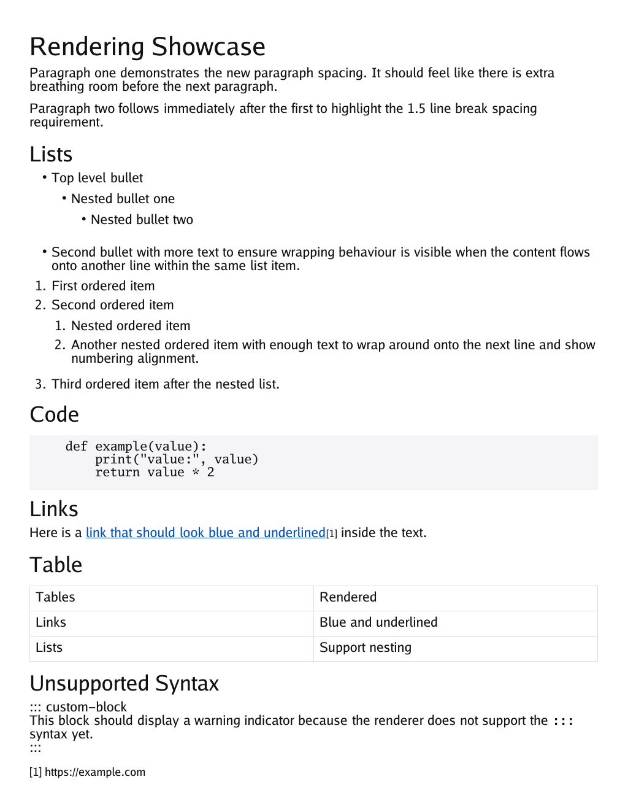
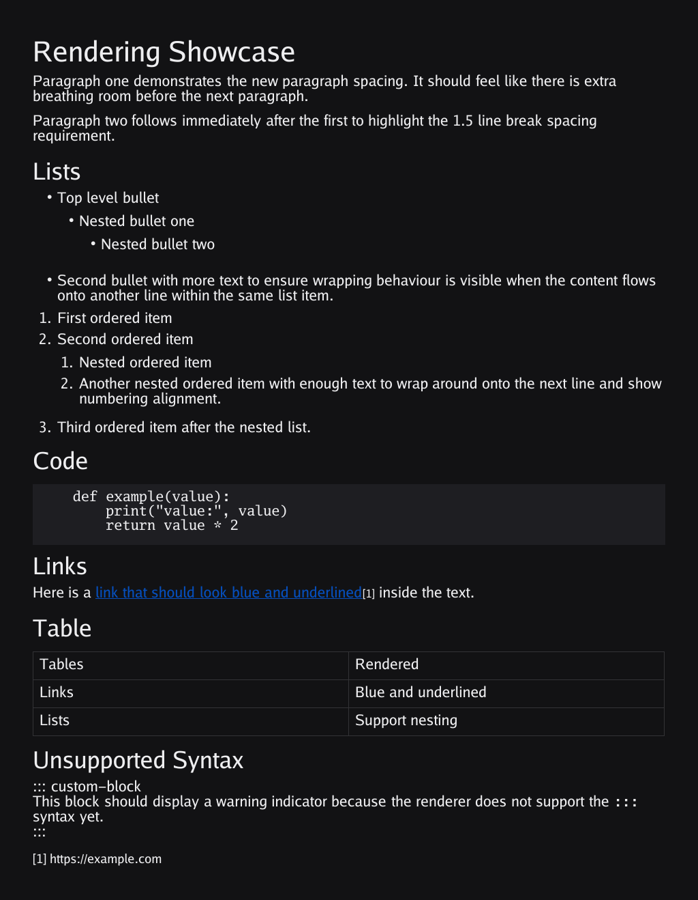

# md2img – Markdown to Image (Go CLI)

`md2img` is a **pure Go command-line tool** that converts Markdown files directly into **PNG** or **JPG** images — no JavaScript, no Python, no scripting runtimes required.

It’s designed for developers who want a **self-contained binary** that can render Markdown into readable, styled images for documentation, blog headers, code snippets, or social previews.

---

## ✨ Features

- **Pure Go** — no browser, Node, or scripting dependencies
- **Renders Markdown natively** (via `goldmark`)
- **Supports**:
    - Headings (H1–H5)
    - Paragraphs
    - Lists (ordered/unordered)
    - **Inline bold text**
    - Code blocks (monospaced background)
    - Blockquotes (with left accent bar)
    - Horizontal rules (`---`, `***`)
- **Light & Dark themes**
- **Custom fonts** (`--font`, `--fontbold`, and `--fontmono`)
- **Adjustable width, margins, and font size**
- **Outputs PNG or JPG** depending on file extension

---

## 🧱 Installation

### Clone & Build

```bash
git clone https://github.com/arran4/md2img.git
cd md2img
go build -o md2img
```

### Dependencies

All dependencies are pure-Go libraries:

```bash
go get github.com/yuin/goldmark@v1.7.4 \
       github.com/golang/freetype@v0.0.0-20170609003504-e2365dfdc4a0 \
       golang.org/x/image@latest
```

No external tools required — just Go ≥1.22.

---

## 🚀 Usage

```bash
./md2img -in README.md -out out.png
```

### Options

| Flag | Description | Default |
|------|--------------|----------|
| `-in` | Input Markdown file (use stdin if empty) | — |
| `-out` | Output image file (.png or .jpg) | `out.png` |
| `-width` | Image width in pixels | 1024 |
| `-margin` | Margin in pixels | 48 |
| `-pt` | Base font size (points) | 16 |
| `-theme` | Theme: `light` or `dark` | `light` |
| `-font` | Regular font (TTF path) | built-in Go Regular |
| `-fontbold` | Bold font (TTF path) | built-in Go Bold |
| `-fontmono` | Monospace font (TTF path) | built-in Go Mono |

---

### Examples

Render a Markdown file to PNG:

```bash
./md2img -in example.md -out example.png
```

Dark theme with larger font and wider layout:

```bash
./md2img -in blogpost.md -out post.png -theme dark -width 1400 -pt 18
```

Using your own fonts:

```bash
./md2img -in notes.md -out notes.jpg \
  -font /usr/share/fonts/TTF/DejaVuSans.ttf \
  -fontmono /usr/share/fonts/TTF/DejaVuSansMono.ttf
```

Pipe Markdown directly:

```bash
echo "# Hello\nThis came from stdin!" | ./md2img -out hello.png
```

---

## 🧩 Output Example

**Light Theme**



**Dark Theme**



---

## ⚙️ How It Works

1. Parses Markdown via [`yuin/goldmark`](https://github.com/yuin/goldmark)
2. Walks the AST and draws text elements directly onto an RGBA image using [`freetype`](https://pkg.go.dev/github.com/golang/freetype)
3. Word-wraps text, handles indentation, blockquotes, and code blocks
4. Exports as PNG or JPEG depending on `-out` extension

All rendering happens in memory — no HTML or external conversion.

---

## 🧠 Roadmap

- [ ] Tables
- [ ] Inline images
- [ ] Syntax highlighting
- [ ] SVG output
- [ ] Configurable themes via YAML/JSON

---

## 🪪 License

MIT © 2025 Arran4
